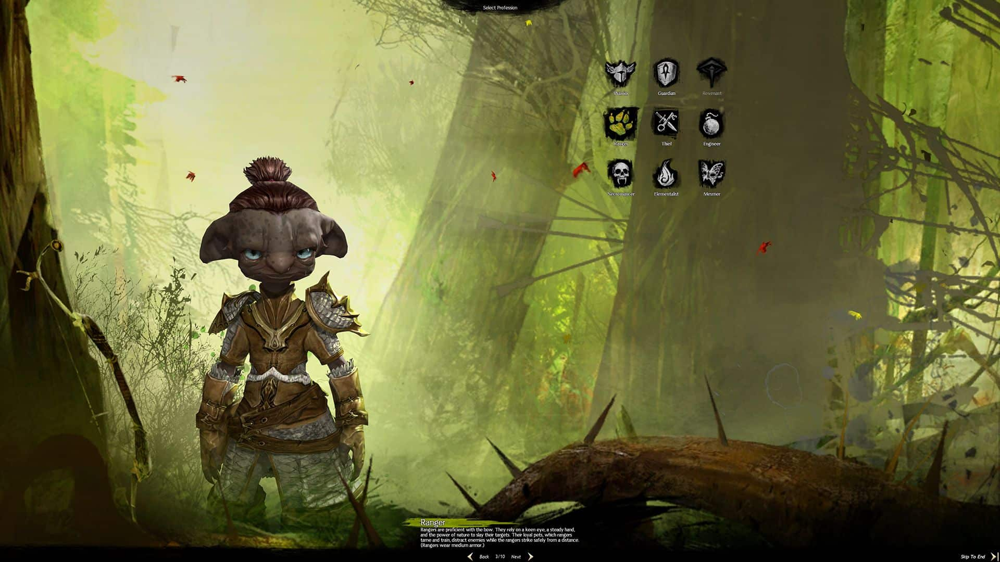
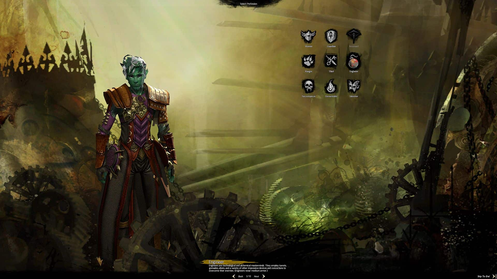
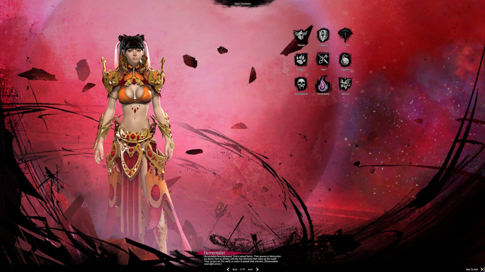
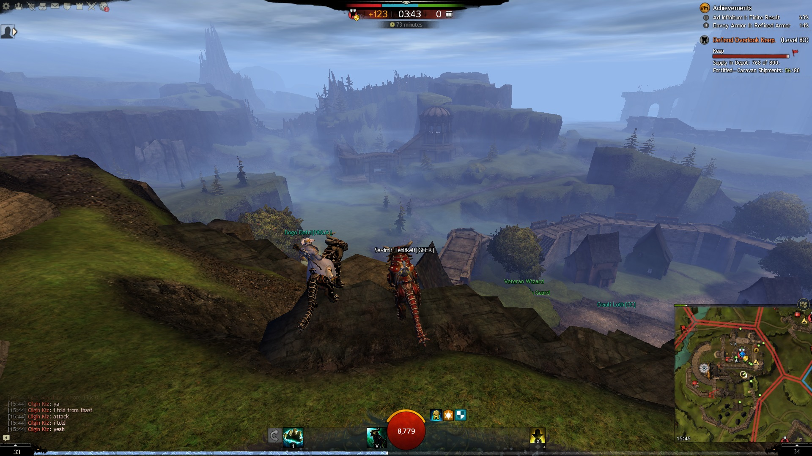

# Guild Wars 2 Başlangıç Rehberi

Guild Wars 2 başlangıç rehberine hoş geldin, bu rehber nedir diye soracak olursan oyuna başlamayı düşünüyorsan ya da daha yeni başladın ve oyunda ne içerikler var, nasıl bir oyun ve ufak temel bir rehber niteliğinde bir yazı olacak. Guild Wars 2 2012 de başlayıp ortalığı miyavlayan ve hâlâ miyavsal derecede harika içerikler ve arkadaş canlısı bir ortam sunuyor.

Aşağıdaki rehberde oyuna yeni başlayacak birisi olduğunuzu göz önüne alarak en temelden anlatım yapacağım. O zaman başlayalım:

## Hesap Türleri

Satın aldığınız pakete göre hesap türleri vardır, bunlar şu şekildedir:

1. **Ücretsiz Hesap**
2. **Core Hesap**
3. **Heart of Thornes Hesabı**
4. **Path of Fire Hesabı**

30 Ağustos 2019 itibariyle, PoF satın aldığınızda ek ücret ödemeden size HoT veriliyor!

ArenaNet tarafından resmi [forumlarında](https://help.guildwars2.com/hc/en-us/articles/230165307-Guild-Wars-2-Account-Types-Free-Core-HoT-PoF) bize verilen hesap türlerinin özelliklerine bir göz atabilirsiniz.

Kişisel olarak oyunu satın almanızı tavsiye ederim bunun sebebi ise oyunda zaten P2W hiç yok ve oyun sizden başka ücret ödemenizi istemiyor, oyun içi goldu dönüştürerek istediğiniz her şeyi alabilirsiniz. Oyunu uygun fiyatlı olarak nereden alabilirim diye soracak olursan durmaplay sitesi üzerinden şu anda en uygun fiyata PoF paketini alırsan oyunun bütün paketlerini almış olabilirsin.

## Sunucu Seçimi

Guild Wars 2'de sunucu seçiminin WvW dışında bir önemi yoktur. Fakat şöyle bir şey var ki sunucunuzu kendi bölgenizde seçmeniz önemle tavsiye edilir, Avrupa'daysanız Avrupa, Amerika'daysanız Kuzey Amerika sunucularını seçmeniz gerekmektedir.

## Karakter Oluşturma

*Tyria'nın beş ırkı. Soldan sağa: Charr, Human, Norn, Asura, Sylvari*

Guild Wars 2'de, oyunun herhangi bir sürümünü satın aldıysanız 5, ücretsiz oynuyorsanız 2 karakter oluşturabilirsiniz. Oyunu satın aldığınızda diğer karakter slotları açılacaktır. Aralarından seçim yapabileceğiniz 5 adet Irk mevcuttur:

1. **Charr**
2. **İnsan**
3. **Norn**
4. **Asura**
5. **Sylvari**

Irk seçimi, bazı ırksal becerilerin değişmesine ve, kişisel hikayenizi ve başlangıç noktanızı belirler. Fakat bu ırksal becerilerin pek önemi yoktur, pek kullanılmazlar ve PvP de kullanım dışı kalırlar. Bu becerileri merak ederseniz [buraya](https://wiki.guildwars2.com/wiki/Racial_skill) tıklayarak detaylarını öğrenebilirsiniz. Benim tavsiyem tipini sevdiğiniz ırkı açmanız olur.

Daha sonrasında sınıfınızı seçebilirsiniz. Oyunda Heart of Thorns ek paketi ile gelen **Revenant** sınıfı ile birlikte toplamda 9 adet sınıf bulunmaktadır. Bu da demek oluyor ki HoT paketiniz yoksa bu sınıfı oynayamazsınız.

Her sınıfı detaylı bir şekilde tanımlamak değişen metadan ve oynayış stili farklılıklarından dolayı pek de mümkün değildir, fakat yüzeysel ve basit bir biçimde anlatmaya ve açıklamaya çalışacağım.

### :gw2-warrior-white: Warrior

| Genel Bilgi       |             |
| ----------------- | ----------- |
| **Roller:**       | DPS, Support|
| **Zırh:**         | Heavy       |
| **Silahlar:**     |**Two Handed:** Hammer, Greatsword, Longbow, Rifle   **Main Hand:** Sword, Axe, Mace   **Off Hand:** Sword, Axe, Mace, Warhorn, Shield   **Underwater:** Spear, Harpoon Gun |
| **Alt Sınıflar:** | **Berserker** (Torch kullanımı açılıyor, HoT ek paketi gerekiyor)   **Spellbreaker** (Dagger kullanımı açılıyor, PoF ek paketi gerekiyor) |

### :gw2-guardian-white: Guardian

| Genel Bilgi       |             |
| ----------------- | ----------- |
| **Roller:**       | DPS, Support, Healer, Tank |
| **Zırh:**         | Heavy       |
| **Silahlar:**     |**Two Handed:** Hammer, Greatsword   **Main Hand:** Sword, Mace, Scepter   **Off Hand:** Focus, Torch, Shield   **Underwater:** Spear, Trident |
| **Alt Sınıflar:** | **Dragonhunter** (Longbow kullanımı açılıyor, HoT ek paketi gerekiyor)   **Firebrand** (Axe kullanımı açılıyor, PoF ek paketi gerekiyor) |

### :gw2-revenant-white: Revenant

!!! warning "Uyarı"
    Bu sınıfı oynamanız için Heart of Thorns ek paketine ihtiyacınız vardır.

| Genel Bilgi       |             |
| ----------------- | ----------- |
| **Roller:**       | DPS, Support, Healer |
| **Zırh:**         | Heavy       |
| **Silahlar:**     |**Main-Hand:** Mace, Sword   **Off-Hand:** Axe, Sword, Shield   **Two-Handed:** Hammer, Staff   **Underwater:** Spear, Trident |
| **Alt Sınıflar:** | **Herald** (Shield kullanımı açılıyor)   **Renegade** (Shortbow kullanımı açılıyor, PoF ek paketi gerekiyor) |

### :gw2-ranger-white: Ranger

| Genel Bilgi       |             |
| ----------------- | ----------- |
| **Roller:**       | DPS, Healer |
| **Zırh:**         | Medium      |
| **Silahlar:**     |**Two Handed:** Longbow, Shortbow, Greatsword   **Main Hand:** Sword, Axe   **Off Hand:** Axe, Dagger, Torch, Warhorn   **Underwater:** Spear, Harpoon Gun |
| **Alt Sınıflar:** | **Druid** (Staff kullanımı açılıyor, HoT ek paketi gerekiyor)   **Soulbeast** (Main-Hand Dagger kullanımı açılıyor, PoF ek paketi gerekiyor) |

### :gw2-thief-white: Thief

| Genel Bilgi       |             |
| ----------------- | ----------- |
| **Roller:**       | DPS |
| **Zırh:**         | Medium      |
| **Silahlar:**     |**Two Handed:** Shortbow   **Main-Hand:** Dagger, Pistol, Sword   **Off-Hand:** Dagger, Pistol   **Underwater:** Harpoon Gun, Spear |
| **Alt Sınıflar:** | **Daredevil** (Staff kullanımı açılıyor, HoT ek paketi gerekiyor)   **Deadeye** (Rifle kullanımı açılıyor, PoF ek paketi gerekiyor) |

### :gw2-engineer-white: Engineer

| Genel Bilgi       |             |
| ----------------- | ----------- |
| **Roller:**       | DPS, Support, Healer |
| **Zırh:**         | Medium      |
| **Silahlar:**     |**Two-Handed:** Rifle, Hammer   **Main-Hand:** Pistol, Sword   **Off-Hand:** Pistol, Shield   **Underwater:** Harpoon Gun |
| **Alt Sınıflar:** | **Scrapper** (Hammer kullanımı açılıyor, HoT ek paketi gerekiyor)   **Holosmith** (Sword kullanımı açılıyor, PoF ek paketi gerekiyor) |

### :gw2-necromancer-white: Necromancer

| Genel Bilgi       |             |
| ----------------- | ----------- |
| **Roller:**       | DPS, Support, Healer |
| **Zırh:**         | Light      |
| **Silahlar:**     |**Two Handed:** Staff   **Main Hand:** Axe, Dagger, Scepter   **Off-Hand:** Dagger, Scepter, Warhorn   **Underwater:** Spear, Trident |
| **Alt Sınıflar:** | **Reaper** (Greatsword kullanımı açılıyor, HoT ek paketi gerekiyor)   **Scourge** (Torch kullanımı açılıyor, PoF ek paketi gerekiyor) |

### :gw2-elementalist-white: Elementalist

| Genel Bilgi       |             |
| ----------------- | ----------- |
| **Roller:**       | DPS, Healer |
| **Zırh:**         | Light      |
| **Silahlar:**     |**Two Handed:** Staff   **Main Hand:** Dagger, Scepter   **Off-Hand:** Dagger, Focus   **Underwater:** Trident |
| **Alt Sınıflar:** | **Tempest** (Warhorn kullanımı açılıyor, HoT ek paketi gerekiyor)   **Weaver** (Sword kullanımı açılıyor, PoF ek paketi gerekiyor) |

### :gw2-mesmer-white: Mesmer

| Genel Bilgi       |             |
| ----------------- | ----------- |
| **Roller:**       | DPS, Support, Tank |
| **Zırh:**         | Light      |
| **Silahlar:**     |**Two Handed:** Greatsword, Staff   **Main Hand:** Axe, Scepter, Sword   **Off-Hand:** Focus, Pistol, Shield, Sword, Torch   **Underwater:** Spear, Trident |
| **Alt Sınıflar:** | **Chronomancer** (Shield kullanımı açılıyor, HoT ek paketi gerekiyor)   **Mirage** (Axe kullanımı açılıyor, PoF ek paketi gerekiyor) |

Aşağıdaki videoyu izleyerek sınıflar ve alt sınıflar hakkında görünüşsel, animasyonsal ve skillsel fikir edinebilirsiniz.

<iframe width="560" height="315" src="https://www.youtube.com/embed/y4D2dqG0eoE" title="YouTube video player" frameborder="0" allow="accelerometer; autoplay; clipboard-write; encrypted-media; picture-in-picture; web-share" allowfullscreen></iframe>

## Oyun

Oyun içerik olarak genel hatlarıyla üçe ayrılıyor bunlar; PvE, PvP, WvW. Gelin bunlara yüzeysel olarak bakalım:

### PvE

Oyununa ana içeriklerinden birisidir, oyuncular arası kavga ve dövüşten uzaktır. Etkinlikler, world bosslar, zindanalar, raidler, hikayeler, vb.. şeyler vardır.

### PvP

Oyunun PvP si şu nedenlerden ötürü çok güzeldir, birincisi seviye sınırı yoktur bu da demek ki 1 seviye bir karakterinizle direkt pvp girebilirsiniz bütün skilleri açık olacaktır, ikincisi ise eşyaların statlarının bir önemi yoktur, ölçeklendirilmiş bir stat sistemi vardır. Genellikle 5v5 oynanır, bölge tutma, takım ölüm maçı, yan objektifler yapmalı modları vardır.

### WvW

Sunucunuzu temsil ettiğiniz bu modda her hafta en çok Kamp, Kule ve Kaleyi elinde tutacak diğer 2 sunucu ile karşı karşıya kalırsınız, kısacası sunucunuzun onuru sunucudaki oyunculara bağlıdır. Fightlar genelde 1v1 den başlayıp 100v100 e kadar gidebilir. Ve bu modda eşyaların statlarının önemi vardır. Bilgisayarınız çok iyi değilse grafik ayarlarından Model Limit ve Model Quality ayarlarınızı düşürmenizi öneririm yoksa kasa üzerinde mangal yapma ihtimaliniz var.

Başlangıç rehberinden şimdilik bu kadar, daha detaylı bir anlatım için "Yeni Oyuncu Rehberi" isimli başlığa bakabilirsin.

_Referanslar:_  
[https://altarofgaming.com/guild-wars-2-beginners-guide-welcome-to-tyria/](https://altarofgaming.com/guild-wars-2-beginners-guide-welcome-to-tyria/)

