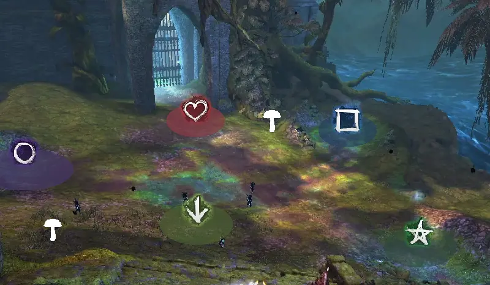
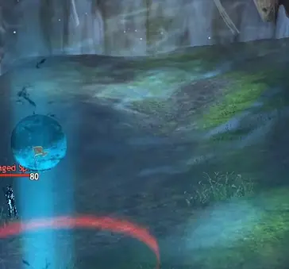
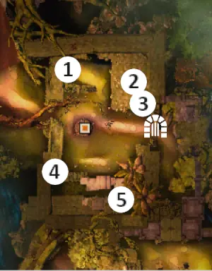

# Spirit Woods

Spirit Woods (veya "Spirit Run") Spirit Vale(Wing 1)'in ilk etkinliğidir. Patlayan rift'leri kapatırken ve hayalet duvarları yıkarken toplam 3 adet etkinliğe sonuna kadar dayanmanız gerekiyor. Bol bol condi temizleme, Aegis ve Stability alın, çünkü bu hayaletler sizi kendi aralarına alasıya kadar rahat durmayacaklar.

## Spirit Woods'a Başlamadan Önce

---

- Gerekli Mastery ve Binekler

    * (opsiyonel: Event 1 de portal açan kişi için) "Adrenal Mushrooms" Mastery
    * (herkes için: Event 2 de) "Glider Basics" Mastery
    * Binek gerekmiyor

- Özel Roller

    * Sadece etkinlik bazlı özel roller gerekiyor(Etkinlik başlıklarında anlatılmıştır)

- Skill Değişimleri

    * Düşmanların yere düşürme etkileri için, Aegis ve Stability skilleri
    * Cripple etkisini silmek için condi silen yetenekler

## Event 1: Rift'leri Kapatmak

---

- Objektif

    * Düşmanlar tarafından saldırıya uğrarken, zaman dolmadan rift'leri kapatın.
    * 20 rift'i 4 dakika içinde kapatın, böylece kapı açılır.

- Özel Roller

    * (opsiyonel) Portal açmak için 1 kişi. Etkinliği daha hızlı bitirmek için rift'ler arasında portal açan kişi.Skill bekleme süresini kısaltmak için mantar yer.

- Ekstra Skill Değişimi

    * (eğer portal açıyorsan) Portal skilleri
    * (opsiyonel) Işınlanma skilleri: Rift'ler arası portal olmadan daha hızlı hareket edebilmek için.

Vale Guardian'ı öldürdükten sonra kuzeye, karanlık tünele doğru gidin. Tüneldeki düşmanları öldürün.

Alanın üzerindeki çıkıntıda bekleyin. **Alandaki düşmanları öldürmeyin, yoksa etkinlik başlar!**

### Rift Bölgelerini İşaretlemek

---

<figure markdown>
  
  <figcaption>Rift spawn(ve Mantar) bölgeleri</figcaption>
</figure>

- İsteğe bağlı olmakla birlikte, 5 adet rift'in çıkma konumu için işaretçilerin kullanılması, deneyimsiz grupların bunları bulmasını kolaylaştırır.

Etkinliği başlatmak için alandaki tüm düşmanları öldürün.

- Temizlik işleminden sonra alana girdiğinizde event başlar.

Alanda düşmanlar ve kırmızı alanlar belirmeye başlar.

Kırmızı alanlar kaybolasıya kadar hep beraber alanın içerisine girin, yoksa tüm takım ölecektir. Alanın içine girdiğinizde alan mavi olacaktır. Alanın yakınlarında çıkan düşmanları öldürün.

- Sayılarını düşük tutmak için dülmanları öldürün, yoksa birikeceklerdir.
- Zaman geçtikçe alanlar daha hızlı ortaya çıkmaya başlar. **Önce eski alanları kapatın!**
- (portal kullanılıyorsa) Portal açan kişi, bekleme sürelerini sıfırlamak için Adrenal Mushroom kullanarak uzak alanlar arasında portallar açar.

### Rift'leri Kapatmak

---

<figure markdown>
  
  <figcaption>Rift Kapatmak</figcaption>
</figure>

Rift'ler: Yavaşça yere doğru yaklaşan mavi bir küre şeklindedir. Ortaya çıktıktan 20 saniye sonra oyuncular tarafından kapatılmazsa, takım çapında büyük hasar vermek için patlarlar.

- Kapatılmamış alanların kırmızı halkaları vardır. Kapanmakta olan alanların mavi halkaları vardır. Daha fazla oyuncu = alanın daha hızlı kapanması.
- Patlamaya yakın alanlarda mavi küreler yerine kırmızı küreler bulunur.

Event 1'i bitirmek için 20 Rift'i 4 dakika içinde kapatın.

- Toplam kapalı ve açık rift'lerin ilerlemesini görmek için ekranın köşesine bakabilirsiniz.

Açılan kapıdan ilerleyip köprüyü geçin. En ileride soldaki sütunun arkasına toplanarak düşmanların çoğunu öldürmeyi kolaylaştırın.

Event 2'nin kapısını açmak için tüm düşmanları öldürün. Kapıdan geçerek platformda bekleyin. **Aşağı atlamayın, yoksa etkinlik başlar!**

## Event 2: Ruhlardan Kaçış

---

- Objektif

    * Düşmanlar tarafından saldırıya uğrarken, rift kapatırken ve rüzgar duvarı keserken, arkadan gelen öldürücü duvardan kaç.
    * Son rüzgar duvarını kesin, böylece öldürücü duvar ortadan kalkar.

- Özel Roller

    * 4 rift kapatıcı: Rift'leri kapatan oyunculara destek olun ve rüzgar duvarını kesenlere katılın.
    * 6 rüzgar duvarını kesici: DPS oyuncuları Rift'lerden' geçer (kapatmaya yardımcı olmak için) ve Rüzgar Duvarı'ı keserler.
    * (isteğe bağlı) 1–2 portal açıcı(lar): Rüzgar Duvarının son rift'leri arasında portallar oluşturur.

- Genel Rift Kapatma Stratejisi

    * Farklı gruplar genellikle farklı sayıda rift kapatıcı ve rüzgar duvarı kesici kullanır. Yalnızca healer rift kapatıcı veya daha fazla DPS rift kapatıcı gibi.

- Ekstra Skill Değişimi

    * (eğer portal açıyorsan) Portal skilleri

<figure markdown>
  
  <figcaption>Başlangıç platformu ve gidiş yönü</figcaption>
</figure>

Ready Check kullanın. Herkes hazır olduğunda, aynı anda zıplayın ve işaretli konuma (yukarıdaki resimde) olabildiğince uzağa süzülün.

- Glide ile, arkadan gelen öldürücü duvardan daha hızlı uzaklaşırsınız.

<figure markdown>
  
  <figcaption>Rift ve Rüzgar Duvarı</figcaption>
</figure>

İlerlemeye devam etmek için rüzgar bariyerini kesin ve patlamayı önlemek için Rift'i kapatın. Bunu yaparken, düşmanların saldırısına uğruyorsunuz ve öldürücü duvardan kaçıyorsunuz.

- Rift kapatıcılar, Rift'i öncelik sırasına göre(daha önce çıkan daha önceliki) kapatır ve ardından duvar kesicilere katılır.
- Duvarların çok büyük hitbox'ları vardır, bu nedenle rift'leri kapatırken genellikle menzilli ve hatta yakın dövüş saldırılarını kullanabilirsiniz.

Rift'leri kapatmaya ve duvarları kesmeye devam edin. Üçüncü bariyerden sonra glide açıp süzülün. Dördüncü bariyer için, duvar kesiciler menzilli DPS'ye sahipse, DPS atarken üçüncü rift'i kapatın.

<figure markdown>
  
  <figcaption>Rift ve Rüzgar Duvarı Konumları</figcaption>
</figure>

- 1 rift 1.duvardan önce.
- 1 rift 2.duvardan önce.
- 2 rift 3.duvardan önce. **Duvardan sonra, boşluğun üzerinden süzülün!**
- 3 rift 4.duvardan önce. Portallar sıklıkla kullanılır, bu nedenle rift kapatıcıların rift'ler arasında koşması gerekmez.

Event 2'yi bitirmek için dördüncü duvarı kesin.

Düşmanları görmezden gelerek düz, sola ve ardından merdivenlerden yukarı koşun. Event 3 mezarlıkta geçiyor.

## Event 3: Basınç Plakaları

---

- Objektif

    * Düşmanlar tarafından saldırıya uğrarken, oyuncular 5 baskı plakası üzerinde dururlar.
    * Aynı anda 5 baskı plakasında ayakta duran oyuncular olması gerekiyor, bu şekilde kapı açılır.

<figure markdown>
  
  <figcaption>Basınç Plakaları ve Kapı Lokasyonu</figcaption>
</figure>

<figure markdown>
  
  <figcaption>Jumping Puzzle ile gidilen basınç plakası</figcaption>
</figure>

Basınç plakaları (“butonlar”) 5 farklı konumdadır. Onlara ulaşmanın birçok yolu vardır;

- *jumping puzzle:* Ağaç dalına atlayın ve ardından mantarlar görünene kadar dalın üzerinden geçin. İnce dalların değil mantarların üzerinden yükseltilmiş platforma atlayın.
- *gazebo:* Ağaç dalına atlayın ve ardından mantarlar görünene kadar üzerinden geçin. Yakındaki platforma atlayın ve ardından küçük yapının içine koşun.
- *across the gap:* Merdivenlerden ağacın üzerine çıkın ve atlayıp glide açın. Düz devam ederek sağdaki platforma atlayın.
- *mausoleum:* Girişten sağa dönün, mezar taşlarını geçtikten sonra merdivenlere çıkın. Çıktıktan sonra sola dönüp sarmaşıklarla kaplı kapıdan girip yolu takip edin.
- *merdivenin altı:* Girişten sola dönün. Basınç plakası merdivenlerin altındadır.

Event 3'ü bitirmek için 5 basınç plakasının hepsinin üzerinde aynı anda canlı oyuncular olması gerekir.

- Yere düşen ve ölü oyuncular sayılmaz.
- Merdivenin altındaki basınç plakasını yapıyorsanız, oyuncuların diğerlerinin üzerinde durmasını bekleyin, bu plaka en çok düşman tarafından saldırıya uğrar.

Açılan kapıdan geçin.

## Örnek Video

---

<iframe width="1280" height="430" src="https://www.youtube.com/embed/GWpVu-GKIyI" title="YouTube video player" frameborder="0" allow="accelerometer; autoplay; clipboard-write; encrypted-media; gyroscope; picture-in-picture; web-share" allowfullscreen></iframe>
